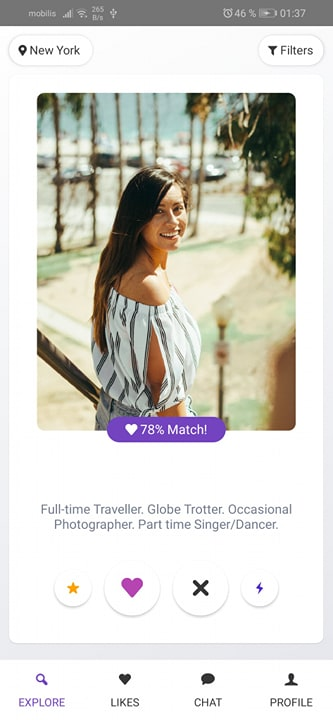
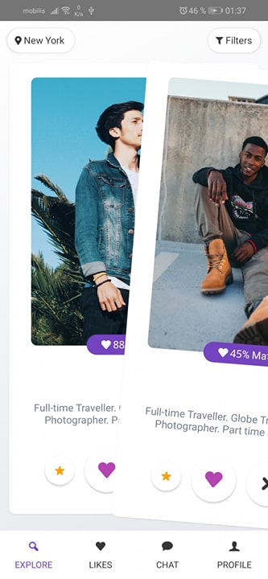
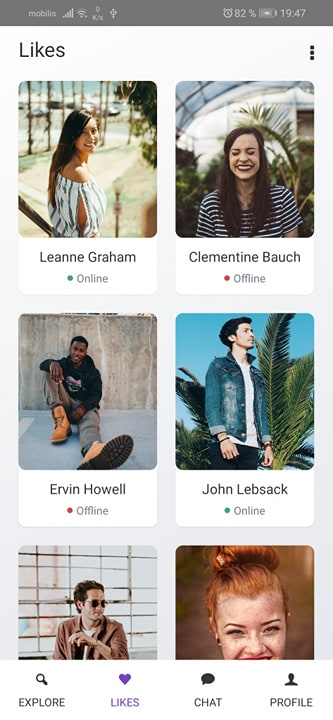
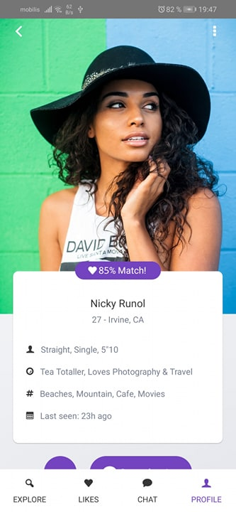
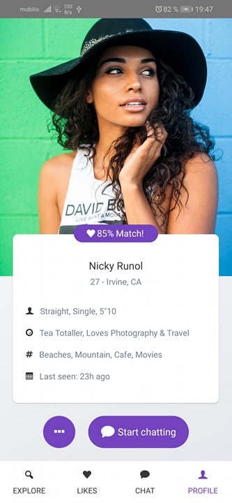
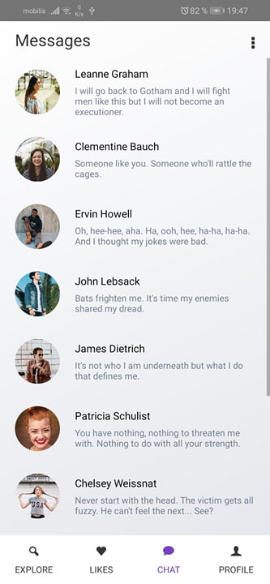

# tinder like app - Matchem -

this repo represent my implementation for a tinder like app called Matchem, the design is inspired from [Dribbble](https://dribbble.com/shots/5631075-Dating-App-Sketch-Freebie-Day-334-365-Project365).

this app contains only the front end and the navigation without any implementation of other handlers.

this project can help new react native devs in getting used to different native components and the use of custom styling while following a proper design.

(i didn't test the code in ios because i don't have one :'( )

## how does the app look

- **Explore :** 

|               home               |             swipe              |
| :------------------------------: | :----------------------------: |
|  |  |

- **Likes :** 

- **Profile :**

|            profile 1             |             profile 2             |
| :------------------------------: | :-------------------------------: |
|  |  |

- **Chat :**

## Project structure

because the interest of this project is only the visualization (without other functionalities only the design), our project structure is rather simple. We can find 3 main sub folders containing all our code.

- assets
- components
- screens

the assets folders contain all the custom style and images and fonts ...

the component folder contains some elements code to separate them from the screens (more maintainable).

screen is self explanatory.

------

## How to run

1. Prepare your environment by following the getting started [tutorial](https://reactnative.dev/docs/getting-started).
2. clone this repo, and go to the project root directory.
3. run yarn install.
4. run yarn start to run it on android (check package.json file).

------

For anyone interested with the project, feel free to contact me anytime in my email:

[fa_djellal@esi.dz]()