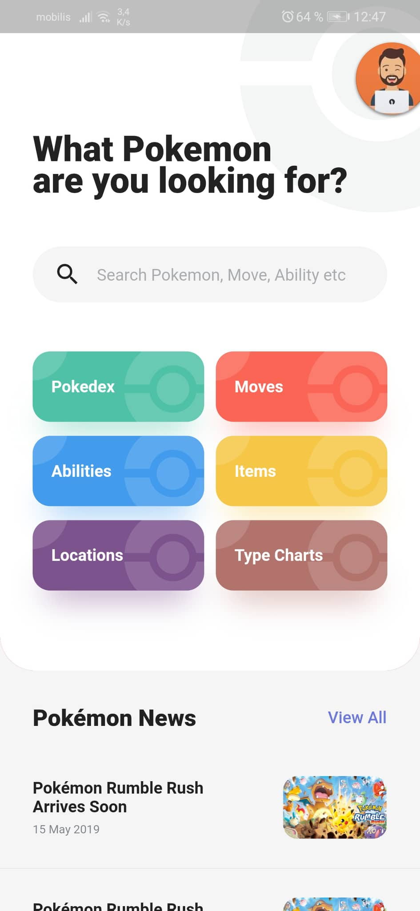
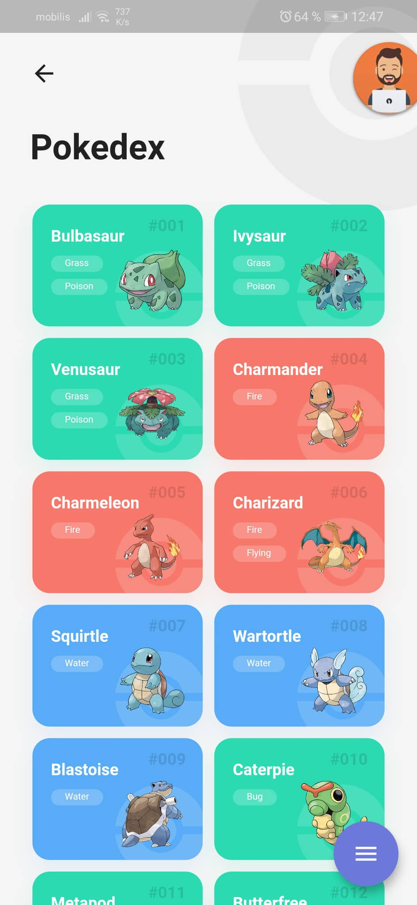
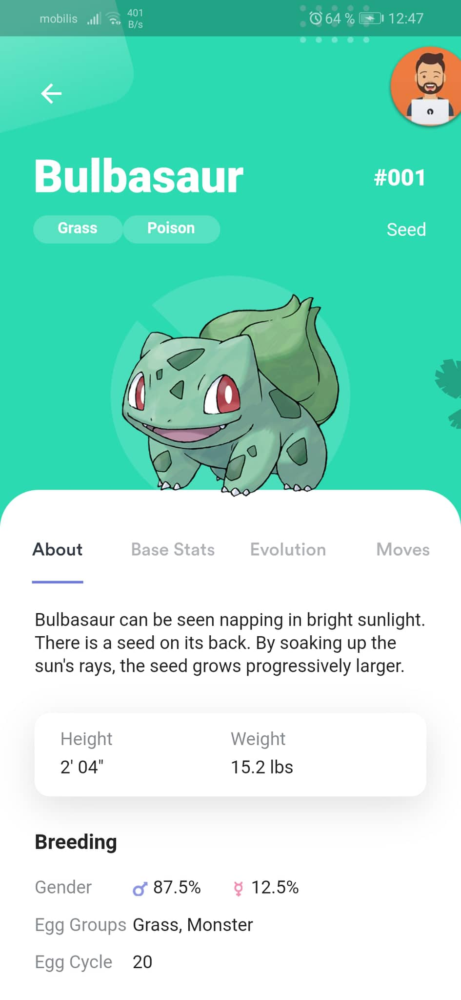

# Pokemon Galery and Infos - Pokedex -

his repo represent my simple implementation with React native of a pokemon galery named pokedex, the project is tested only in android (because i dont have a mac for the moment :'( ).

this repo is a hobby project to implement a nice pokemon app using [Pokemon api](https://pokeapi.co/) .

the project is currently paused for a long time for educational reasons, but i plan on finishing it later and changing its current architecture to a better one.

## How does the app look like ?

- **Home :** 

- **Galery :**

- **Pokemon Info :**

## How to run ?

1. Prepare your environment by following the getting started [tutorial](https://reactnative.dev/docs/getting-started).
2. clone this repo, and go to the project root directory.
3. run yarn install.
4. run yarn start to run it on android (check package.json file).

------

## Design template

the design for this project was inspired by this link in [dribbble](https://dribbble.com/shots/6540871-Pokedex-App) , and the animations by some react native known tutorials in youtube and in documentations.

------

For anyone interested in my work, feel free to contact me anytime on my mail box : [fa_djellal@esi.dz]()